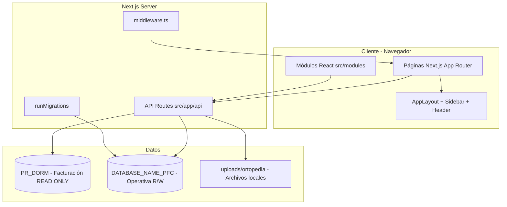
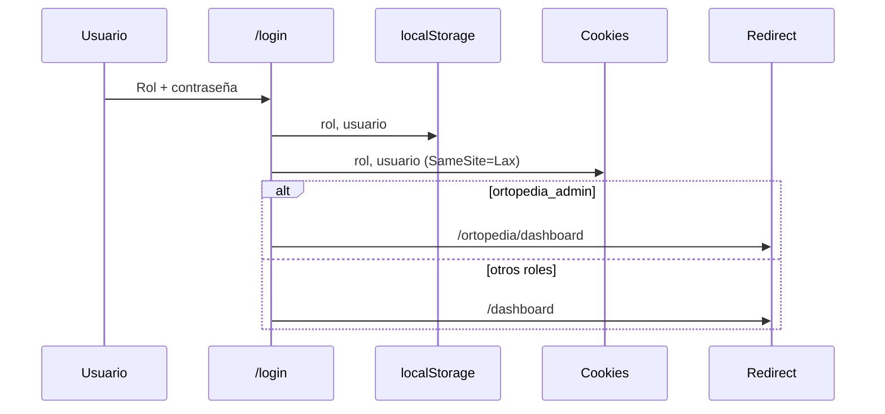
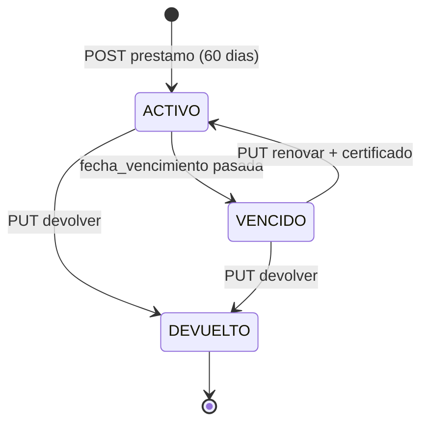
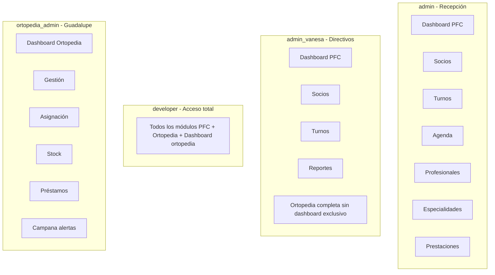

# Documentación completa — Sistema Gestión PFC

**Proyecto:** `pfc-gestion-system`  
**Institución:** Cooperativa Eléctrica de San José de la Dormida  
**Versión package:** `0.1.0`  
**Última revisión documental:** agosto 2026  

---

## Índice

1. [Resumen ejecutivo](#1-resumen-ejecutivo)
2. [Stack tecnológico](#2-stack-tecnológico)
3. [Arquitectura del sistema](#3-arquitectura-del-sistema)
4. [Estructura del repositorio](#4-estructura-del-repositorio)
5. [Bases de datos y conexiones](#5-bases-de-datos-y-conexiones)
6. [Autenticación, roles y permisos](#6-autenticación-roles-y-permisos)
7. [Módulos funcionales](#7-módulos-funcionales)
8. [Módulo Ortopedia (detalle)](#8-módulo-ortopedia-detalle)
9. [Reglas de negocio PFC](#9-reglas-de-negocio-pfc)
10. [API REST — catálogo completo](#10-api-rest--catálogo-completo)
11. [Rutas frontend — catálogo completo](#11-rutas-frontend--catálogo-completo)
12. [Interfaz de usuario y UX](#12-interfaz-de-usuario-y-ux)
13. [Migraciones SQL y esquema operativo](#13-migraciones-sql-y-esquema-operativo)
14. [Variables de entorno e instalación](#14-variables-de-entorno-e-instalación)
15. [Flujos operativos recomendados](#15-flujos-operativos-recomendados)
16. [Documentación complementaria](#16-documentación-complementaria)
17. [Limitaciones y consideraciones técnicas](#17-limitaciones-y-consideraciones-técnicas)

---

## 1. Resumen ejecutivo

**Gestión PFC** es una aplicación web interna para administrar el **Plan de Financiamiento Colectivo (PFC)** de la cooperativa. Combina:

- **Datos reales de socios** desde la base de facturación (solo lectura).
- **Operación médica y administrativa** en una base PFC dedicada (lectura/escritura).
- **Reglas de negocio** centralizadas para cobertura, beneficios familiares y cupos.

### Problema que resuelve

| Área | Antes (manual / disperso) | Con el sistema |
|------|----------------------------|----------------|
| Turnos | Planillas, errores de cobertura | Reserva validada contra cupos y límites anuales |
| Socios | Consultas aisladas | Búsqueda unificada con reglas de beneficio visibles |
| Ortopedia | Registro parcial de préstamos | Expediente completo con trámite, certificado y alertas |
| Dirección | Sin KPIs en tiempo real | Dashboards operativos y de reportes |

### Módulos principales hoy

| Bloque | Módulos |
|--------|---------|
| **Core PFC** | Dashboard, Socios, Turnos, Agenda, Profesionales, Especialidades, Prestaciones, Reportes |
| **Ortopedia** | Dashboard ortopedia, Gestión de elementos, Asignación, Stock, Préstamos |

---

## 2. Stack tecnológico

| Capa | Tecnología | Versión aprox. |
|------|------------|----------------|
| Framework | Next.js (App Router) | 14.2.x |
| UI | React | 18.3.x |
| Lenguaje | TypeScript | 5.x |
| Estilos | Tailwind CSS | 4.x |
| Componentes | shadcn / Base UI | — |
| Base de datos | Microsoft SQL Server | vía `mssql` 12.x |
| Gráficos | Recharts | 3.8.x |
| Animaciones | Framer Motion | 12.x |
| Notificaciones | Sonner | 2.x |
| Iconos | Lucide React | 0.577.x |
| PDF | jsPDF + autotable | 4.x / 5.x |
| Tipografía | Geist Sans + DM Serif Display | — |
| Temas | next-themes | dark/light |

### Scripts npm

```bash
npm run dev      # Desarrollo (puerto 3000 por defecto)
npm run build    # Build de producción
npm run start    # Servidor producción
npm run lint     # ESLint
```

---

## 3. Arquitectura del sistema



### Patrón arquitectónico

- **Monolito Next.js full-stack:** el frontend y el backend (BFF) conviven en el mismo proyecto.
- **API Routes** como capa de servicio: validación de negocio en servidor, no solo en cliente.
- **Pools SQL separados:** lectura de socios aislada de escritura operativa.
- **Módulos UI reutilizables:** lógica pesada en `src/modules/` (ortopedia, socios).

### Arranque de la aplicación

1. `src/app/layout.tsx` ejecuta `runMigrations()` contra la base PFC.
2. `UserProvider` inicializa el rol desde cookie/localStorage.
3. `AppLayout` envuelve todas las rutas excepto `/login`.
4. `middleware.ts` protege rutas de página según cookie `rol`.

---

## 4. Estructura del repositorio

```
pfc-gestion-system/
├── middleware.ts                 # Protección de rutas por cookie
├── package.json
├── public/                       # Assets estáticos (logo cooperativa)
├── sql/                          # Scripts SQL manuales de migración
├── uploads/
│   ├── ortopedia/                # Certificados médicos (flujo nuevo)
│   └── ortopedia-certificados/   # Certificados de renovación (legacy)
├── src/
│   ├── app/                      # App Router: páginas + API
│   │   ├── api/                  # 45 endpoints REST
│   │   ├── dashboard/
│   │   ├── socios/
│   │   ├── turnos/
│   │   ├── ortopedia/            # 6 rutas ortopedia
│   │   ├── reportes/
│   │   └── ...
│   ├── components/
│   │   ├── layout/               # Shell: sidebar, header, command palette
│   │   ├── turnos/               # Modales de turnos
│   │   └── ui/                   # Primitivos (Card, Table, Dialog, Badge...)
│   ├── data/                     # Datos mock / semilla (dev)
│   ├── hooks/                    # use-ortopedia-dashboard, use-motion-settings
│   ├── lib/                      # Lógica compartida, SQL, reglas, roles
│   ├── modules/                  # UI por dominio
│   │   ├── ortopedia/            # 7 archivos del módulo ortopedia
│   │   └── socios/               # socios-page-client.tsx
│   ├── styles/
│   └── types/
└── *.md                          # Documentación del proyecto
```

### Archivos núcleo (`src/lib/`)

| Archivo | Responsabilidad |
|---------|-----------------|
| `sqlserver.ts` | Pools SQL dual + migración runtime `es_carga_manual` |
| `roles.ts` | Constantes de rol, contraseñas simuladas, helpers |
| `user-context.tsx` | Estado de rol, matriz de acceso a módulos |
| `pfc-rules.ts` | **Fuente única de verdad** para cobertura/beneficios |
| `adherentes-beneficios.ts` | Wrapper de reglas para turnos e historial |
| `turnos-lifecycle.ts` | Transiciones de estado de turnos |
| `fecha-turno.ts` | Normalización fecha/hora |
| `ortopedia-dashboard.ts` | Métricas, gráficos y alertas ortopedia |
| `ortopedia-prestamos.ts` | Queries préstamos + enriquecimiento socios |
| `ortopedia-certificado.ts` | Validación y guardado de archivos |
| `profesionales-context.tsx` | Contexto client-side profesionales |
| `pdf-export.ts` | Exportación PDF |
| `utils.ts` | Utilidades (`cn`, etc.) |

---

## 5. Bases de datos y conexiones

### Dos bases SQL Server

| Pool | Función | Variables `.env` |
|------|---------|------------------|
| **Read-only** (`getSqlConnection`) | Socios, adherentes, nombres | `USER_DATABASE`, `PASSWORD_DATABASE`, `SERVER_DATABASE`, `DATABASE_NAME` |
| **PFC** (`getSqlConnectionPfc`) | Turnos, ortopedia, catálogos, cobertura | `USER_DATABASE_PFC`, `PASSWORD_DATABASE_PFC`, `SERVER_DATABASE_PFC`, `DATABASE_NAME_PFC` |

Configuración en `src/lib/sqlserver.ts`:
- `encrypt: false`
- `trustServerCertificate: true`
- Pools singleton reutilizados durante la vida del proceso Node

### Vista principal de socios (base facturación)

**`PR_DORM.dbo.vw_socios_adherentes`**

| Campo | Uso |
|-------|-----|
| `COD_SOC` | Código de cuenta del titular |
| `ADHERENTE_CODIGO` | Código del integrante del grupo |
| `ADHERENTE_NOMBRE`, `APELLIDOS` | Identificación |
| `VINCULO` | TITULAR, CONYUGE, HIJO/A, OTROS... |
| `DNI_ADHERENTE` | Documento |
| `DES_CAT` | Categoría del plan (Básico / Plus, etc.) |
| `FECHA_NACIMIENTO` | Cálculo de edad y reglas de beneficio |

### Tablas operativas PFC (referenciadas en código)

| Tabla | Dominio |
|-------|---------|
| `turnos` | Citas médicas reservadas/atendidas |
| `historial_atencion` | Auditoría de cambios en turnos |
| `profesionales` | Médicos / especialistas |
| `especialidades` | Catálogo de especialidades |
| `prestaciones` | Servicios del plan |
| `agenda_profesional` | Bloques horarios semanales |
| `cobertura_anual` | Límite anual por prestación y categoría |
| `cobertura_total_anual` | Límite anual por especialidad y categoría |
| `traslados_turno` | Detalle de traslados (migración 2026) |
| `ortopedia_elementos` | Catálogo de elementos ortopédicos |
| `ortopedia_prestamos` | Préstamos con expediente completo |
| `ortopedia_certificados` | Archivos de certificados por renovación |

---

## 6. Autenticación, roles y permisos

### Modelo actual

Simulación por **rol + contraseña fija** (entorno interno). No hay JWT ni sesiones server-side completas en la mayoría de endpoints API.

### Roles (`src/lib/roles.ts`)

| Clave | Usuario simulado | Contraseña (dev) | Perfil |
|-------|------------------|------------------|--------|
| `admin` | Marianela Farias | `adminPFC2026` | Recepción / operación PFC |
| `admin_vanesa` | Vanesa Caminos | `VanesaPFC2026` | Directivos + ortopedia |
| `developer` | Brian Gelvez | `BrianPFC2026` | Acceso total (todos los módulos) |
| `ortopedia_admin` | Guadalupe Saavedra | `GuadalupePFC2026` | Solo módulo ortopedia |

**Alias legacy en cookies:** `directivo` → `admin_vanesa`, `recepcion` → `admin`.

### Flujo de login



### Middleware (`middleware.ts`)

- **Ruta pública:** `/login`
- **Cookies válidas:** `admin`, `admin_vanesa`, `developer`, `directivo`, `ortopedia_admin`
- Sin cookie válida → redirect `/login`
- Con sesión en `/login` → redirect según rol

### Matriz de acceso a módulos

| Módulo | admin | admin_vanesa | developer | ortopedia_admin |
|--------|:-----:|:------------:|:---------:|:---------------:|
| Dashboard PFC | ✓ | ✓ | ✓ | |
| Socios | ✓ | ✓ | ✓ | |
| Turnos | ✓ | ✓ | ✓ | |
| Agenda profesional | ✓ | ✓ | ✓ | |
| Profesionales | ✓ | ✓ | ✓ | |
| Especialidades | ✓ | ✓ | ✓ | |
| Prestaciones | ✓ | ✓ | ✓ | |
| Reportes | ✓ | ✓ | ✓ | |
| **Dashboard Ortopedia** | | | ✓ | ✓ |
| Gestión elementos | | ✓ | ✓ | ✓ |
| Asignación ortopedia | | ✓ | ✓ | ✓ |
| Stock ortopedia | | ✓ | ✓ | ✓ |
| Préstamos ortopedia | | ✓ | ✓ | ✓ |

Implementación: `canAccessModule(role, module)` en `src/lib/user-context.tsx`.

**Dashboard ortopedia API:** `canAccessOrtopediaDashboard()` → `ortopedia_admin` OR `developer`.

### Redirecciones por rol

| Ruta | Comportamiento |
|------|----------------|
| `/` | `ortopedia_admin` → `/ortopedia`; resto autenticado → `/dashboard` |
| `/ortopedia` | `ortopedia_admin` → `/ortopedia/dashboard`; otros → `/ortopedia/gestion` |

---

## 7. Módulos funcionales

### 7.1 Dashboard PFC (`/dashboard`)

**Audiencia:** Recepción, directivos, developer.

**Datos:** `GET /api/dashboard`

**Muestra:**
- Personas cubiertas, titulares, adherentes
- Turnos del día, operación en curso
- Prestaciones más usadas (gráfico)
- Turnos por mes (tendencia 12 meses)
- Alertas operativas (turnos vencidos, cobertura propia requerida)
- Próximos turnos y actividad reciente

---

### 7.2 Socios PFC (`/socios`)

**Audiencia:** Recepción, directivos, developer.

**Funciones:**
- Búsqueda por apellido, DNI o código de socio
- Segmentación (titulares, hijos menores, cónyuges, cobertura propia...)
- Visualización de vínculo, categoría, edad, tipo de beneficio
- Navegación al grupo familiar (`/socios/[id]`)
- Historial completo por adherente
- Atajo para crear turno

**APIs:** `GET /api/socios`, `GET /api/socios/[cod_soc]`, `GET /api/historial-completo`

**Optimización:** cache en memoria con TTL en listados (ver `OPTIMIZACION_CONSULTAS_SOCIOS_HISTORIAL.md`).

---

### 7.3 Turnos (`/turnos`, `/turnos/nuevo`, `/turnos/[id]`)

**Estados:** `RESERVADO` → `ATENDIDO` | `AUSENTE` | `CANCELADO`

**Creación (`POST /api/turnos`) — validaciones en servidor:**
1. Payload completo (socio, adherente, fecha, hora, profesional, prestación)
2. Categoría real del paciente desde vista de socios
3. Agenda profesional para ese día/hora
4. Slot libre (no ocupado)
5. Cupo mensual del profesional
6. Cobertura anual por prestación
7. Cobertura total anual por especialidad
8. Alcance familiar dinámico según reglas de beneficio (titular vs propio)
9. Inserción transaccional en `turnos` + log en `historial_atencion`

**Transiciones de estado:**
- `ATENDIDO` / `AUSENTE`: solo después de la hora del turno
- Endpoints: `/api/turnos/[id]/atender`, `/ausente`, `/cancelar`

**Carga manual:** `POST /api/turnos/carga-manual` (flag `es_carga_manual`).

---

### 7.4 Agenda profesional (`/agenda-profesional`)

Gestión de bloques semanales (día, hora inicio, hora fin) por profesional. Base para calcular disponibilidad en reserva de turnos.

---

### 7.5 Profesionales (`/profesionales`, `/profesionales/[id]`)

ABM de profesionales: nombre, especialidad, duración de turno, cupo mensual. CRUD restringido principalmente al rol **developer** en UI.

APIs auxiliares: disponibilidad por fecha, turnos del día/mes, agenda.

---

### 7.6 Especialidades y Prestaciones

Catálogos maestros vinculados entre sí. Las prestaciones disponibles para un turno dependen de la categoría del socio (`GET /api/prestaciones-disponibles`).

---

### 7.7 Historial de paciente (`/socios/[id]/[adherente]/historial`)

Vista consolidada:
- Turnos históricos
- Cobertura usada/restante por prestación
- Reglas de beneficio aplicadas
- Export PDF (jsPDF)

---

### 7.8 Reportes (`/reportes`)

**Audiencia:** admin, admin_vanesa, developer (no ortopedia_admin).

**API:** `GET /api/reportes?anio=YYYY`

Gráficos Recharts: uso mensual, estados de turnos, top prestaciones/profesionales/socios, tablas filtrables.

---

## 8. Módulo Ortopedia (detalle)

Módulo independiente para el **banco de elementos ortopédicos** (muletas, sillas de ruedas, caminadores, etc.).

### Submódulos y rutas

| Ruta | Función |
|------|---------|
| `/ortopedia/dashboard` | KPIs, gráficos, alertas, actividad (solo ortopedia_admin + developer) |
| `/ortopedia/gestion` | ABM de elementos (nombre, stock, activo/inactivo) |
| `/ortopedia/asignacion` | Registrar préstamo a socio/adherente |
| `/ortopedia/stock` | Vista de niveles de inventario |
| `/ortopedia/prestamos` | Expedientes, renovación, devolución |

Componente central: `src/modules/ortopedia/ortopedia-module-page.tsx` (secciones por prop `section`).

### Ciclo de vida de un préstamo



- **Stock:** al crear préstamo `stock_disponible -= 1`; al devolver `+= 1`.
- **Plazo:** 60 días por defecto; renovación extiende 60 días más.
- **Auto-vencimiento:** batch SQL marca `VENCIDO` en cada GET de ortopedia.

### Expediente del préstamo

Campos adicionales (migración `2026_ortopedia_prestamos_expediente.sql`):

| Grupo | Campos |
|-------|--------|
| Persona que realiza el trámite | `tramite_nombre`, `tramite_dni`, `tramite_telefono`, `tramite_vinculo` |
| Documentación | `certificado_url`, `fecha_certificado`, `observaciones` (VARCHAR MAX) |

**Certificados:** archivos en `uploads/ortopedia/` (PDF/PNG/JPG, máx. 10 MB). URL en BD, nunca Base64.

### Dashboard ortopedia exclusivo

**API:** `GET /api/ortopedia/dashboard`

**Métricas:** elementos registrados, stock disponible, prestados, vencidos, certificados por vencer, renovaciones pendientes.

**Gráficos:** préstamos por mes, top elementos, estado (dona), stock apilado.

**Alertas (panel campana en header):**
- Préstamos vencidos
- Certificados próximos a vencer (30 días)
- Stock crítico / bajo
- Devoluciones próximas (7 días)

Panel lateral renderizado con **React Portal** en `document.body` (z-index 200+) para evitar quedar detrás del contenido.

**Auto-refresh:** cada 60 segundos vía `useOrtopediaDashboard`.

---

## 9. Reglas de negocio PFC

Fuente única: **`src/lib/pfc-rules.ts`**

### Cobertura familiar vs propia

| Integrante | Regla |
|------------|-------|
| **TITULAR** | Comparte / es titular de cobertura |
| **CONYUGE** | Beneficio del titular |
| **HIJO/A menor de 18** | Beneficio del titular |
| **HIJO/A ≥ 18** | **Cobertura propia** (cuota propia requerida) |
| **OTROS** | Beneficio del titular |

Funciones clave:
- `requiereCoberturaPropia()`
- `calcularCoberturaBeneficiario()` → `COBERTURA_FAMILIAR` | `CUOTA_PROPIA_REQUERIDA`
- `enriquecerSocioConCobertura()` — usada en listados de socios

### Cobertura en turnos

Al crear un turno, el backend determina el **alcance de consumo**:
- **PROPIO:** solo el adherente seleccionado
- **TITULAR:** titular + adherentes que comparten beneficio

Documentado en `COBERTURA_COMPARTIDA_ADHERENTES.md`.

### Cobertura numérica

- `cobertura_anual`: tope por prestación + categoría de plan
- `cobertura_total_anual`: tope por especialidad + categoría

Si se supera el límite → turno rechazado con mensaje claro.

---

## 10. API REST — catálogo completo

Base: `src/app/api/`

### Operación principal

| Método | Endpoint | Descripción |
|--------|----------|-------------|
| GET | `/api/dashboard` | KPIs dashboard PFC |
| GET | `/api/socios?buscar=&limit=&segmento=` | Búsqueda socios |
| GET | `/api/socios/[cod_soc]` | Grupo familiar |
| GET | `/api/socios/[cod_soc]/historial` | Historial simplificado |
| GET | `/api/historial-completo?cod_soc=&adherente_codigo=` | Historial + cobertura |
| GET | `/api/historial-familia-compartida` | Historial alcance familiar |
| GET/POST | `/api/turnos` | Listar / crear turnos |
| GET/PUT/DELETE | `/api/turnos/[id]` | Detalle / editar / eliminar |
| PATCH/PUT | `/api/turnos/[id]/atender` | Marcar atendido |
| PATCH/PUT | `/api/turnos/[id]/ausente` | Marcar ausente |
| PATCH/PUT | `/api/turnos/[id]/cancelar` | Cancelar |
| POST | `/api/turnos/carga-manual` | Alta manual histórica |
| GET/POST | `/api/profesionales` | ABM profesionales |
| GET/PUT/DELETE | `/api/profesionales/[id]` | CRUD por ID |
| GET | `/api/profesionales/[id]/disponibilidad?fecha=` | Slots libres |
| GET/POST | `/api/agenda-profesional` | Agenda |
| GET/PUT/DELETE | `/api/agenda-profesional/[id]` | Bloque agenda |
| GET/POST | `/api/especialidades` | Especialidades |
| GET/PUT/DELETE | `/api/especialidades/[id]` | CRUD especialidad |
| GET | `/api/especialidades/[id]/prestaciones` | Prestaciones de especialidad |
| GET/POST | `/api/prestaciones` | Prestaciones |
| GET | `/api/prestaciones-disponibles` | Filtradas por categoría |
| GET | `/api/reportes?anio=` | Analytics anual |

### Ortopedia

| Método | Endpoint | Descripción |
|--------|----------|-------------|
| GET/POST | `/api/ortopedia` | Elementos + préstamos / crear elemento |
| GET/PUT/DELETE | `/api/ortopedia/[id]` | CRUD elemento |
| GET | `/api/ortopedia/dashboard` | Dashboard ortopedia (rol restringido) |
| POST | `/api/ortopedia/prestamos` | Crear préstamo (JSON o multipart) |
| GET/PUT | `/api/ortopedia/prestamos/[id]` | Expediente / editar trámite |
| PUT | `/api/ortopedia/prestamos/[id]/devolver` | Devolución + stock |
| PUT | `/api/ortopedia/prestamos/[id]/renovar` | +60 días + certificado |
| GET | `/api/ortopedia/prestamos/[id]/certificado` | Servir archivo certificado |
| GET | `/api/ortopedia/files/[filename]` | Archivos uploads/ortopedia |

### Diagnóstico / legacy

| Endpoint | Uso |
|----------|-----|
| `/api/test-sql`, `/api/test-sql-pfc` | Prueba conexión |
| `/api/test-table` | Inspección esquema |
| `/api/agenda`, `/api/cobertura`, `/api/historial` | Compatibilidad |

**Formato de respuesta estándar:**

```json
{ "success": true, "data": { ... } }
{ "success": false, "error": "mensaje" }
```

---

## 11. Rutas frontend — catálogo completo

| URL | Archivo | Descripción |
|-----|---------|-------------|
| `/` | `app/page.tsx` | Redirect por rol |
| `/login` | `app/login/page.tsx` | Acceso |
| `/dashboard` | `app/dashboard/page.tsx` | Dashboard PFC |
| `/socios` | `app/socios/page.tsx` | Listado socios |
| `/socios/[id]` | `app/socios/[id]/page.tsx` | Grupo familiar |
| `/socios/.../historial` | `app/socios/[id]/[adherente]/historial/page.tsx` | Historial |
| `/turnos` | `app/turnos/page.tsx` | Listado turnos |
| `/turnos/nuevo` | `app/turnos/nuevo/page.tsx` | Crear turno |
| `/turnos/[id]` | `app/turnos/[id]/page.tsx` | Detalle turno |
| `/agenda-profesional` | `app/agenda-profesional/page.tsx` | Agenda |
| `/profesionales` | `app/profesionales/page.tsx` | Listado |
| `/profesionales/[id]` | `app/profesionales/[id]/page.tsx` | Ficha |
| `/especialidades` | `app/especialidades/page.tsx` | Catálogo |
| `/prestaciones` | `app/prestaciones/page.tsx` | Catálogo |
| `/reportes` | `app/reportes/page.tsx` | Analytics |
| `/ortopedia` | `app/ortopedia/page.tsx` | Hub redirect |
| `/ortopedia/dashboard` | `app/ortopedia/dashboard/page.tsx` | Dashboard ortopedia |
| `/ortopedia/gestion` | `app/ortopedia/gestion/page.tsx` | ABM elementos |
| `/ortopedia/asignacion` | `app/ortopedia/asignacion/page.tsx` | Asignar préstamo |
| `/ortopedia/stock` | `app/ortopedia/stock/page.tsx` | Stock |
| `/ortopedia/prestamos` | `app/ortopedia/prestamos/page.tsx` | Préstamos |
| `/especialista` | `app/especialista/page.tsx` | Prototipo (sin rol activo) |

---

## 12. Interfaz de usuario y UX

Documentación visual detallada: **`UI-UX-ACTUAL-SISTEMA.md`**

### Shell de aplicación

```
AppLayout
├── Sidebar (grupos: "Gestión PFC" + "Prestación de Ortopedia")
├── Header (sticky, glass, breadcrumbs, rol, campana ortopedia)
├── Main + PageTransition (Framer Motion)
├── Footer institucional
├── Mobile bottom nav (4 primeros módulos permitidos)
└── CommandPalette (Ctrl/Cmd + K)
```

### Patrones UI reutilizados

- `Card`, `Table`, `Button`, `Dialog`, `Badge`, `EmptyState`, `Loading`, `MetricCard`, `Skeleton`
- Toasts con **Sonner**
- Gráficos con **Recharts**
- Identidad verde institucional + acentos violeta en ortopedia
- Modo claro/oscuro (`ThemeToggle`)

### Ortopedia — diferenciación visual

- Grupo sidebar con color violeta
- Items activos con ring violeta
- Dashboard con métricas animadas y acciones rápidas

---

## 13. Migraciones SQL y esquema operativo

### Scripts en `sql/`

| Archivo | Contenido |
|---------|-----------|
| `2026_ortopedia_modulo.sql` | Tablas ortopedia + datos semilla |
| `2026_ortopedia_prestamos_expediente.sql` | Columnas trámite/certificado |
| `2026_traslados_cobertura.sql` | Traslados y cobertura asociada |
| `2026_profesionales_traslados.sql` | Seed profesionales traslados |

### Migración runtime (`runMigrations`)

Ejecutada al iniciar la app:

```sql
ALTER TABLE turnos ADD es_carga_manual BIT NOT NULL DEFAULT 0  -- si no existe
```

---

## 14. Variables de entorno e instalación

### `.env` requerido (8 variables)

```env
# Base facturación (read-only)
USER_DATABASE=
PASSWORD_DATABASE=
SERVER_DATABASE=
DATABASE_NAME=

# Base PFC (operativa)
USER_DATABASE_PFC=
PASSWORD_DATABASE_PFC=
SERVER_DATABASE_PFC=
DATABASE_NAME_PFC=
```

### Requisitos

- Node.js 18+
- Acceso de red al SQL Server
- Permisos de lectura sobre `PR_DORM.dbo.vw_socios_adherentes`
- Permisos R/W sobre tablas PFC
- Carpeta `uploads/` con permisos de escritura (certificados ortopedia)

### Instalación

```bash
cd pfc-gestion-system
npm install
npm run dev
# Abrir http://localhost:3000
```

### Producción

```bash
npm run build
npm run start
```

---

## 15. Flujos operativos recomendados

### Recepción — turno médico

1. Buscar socio en **Socios PFC**
2. Verificar beneficio (titular/propio) y categoría
3. **Crear turno** → especialidad → prestación → profesional → horario
4. Confirmar reserva (`RESERVADO`)
5. Tras la hora: marcar **Atendido** o **Ausente**
6. Consultar **Historial** para cobertura remanente

### Ortopedia — préstamo de elemento

1. **Asignación** → buscar socio/adherente
2. Seleccionar elemento disponible
3. Completar datos del trámite (titular o tercero)
4. Opcional: subir certificado médico
5. Seguimiento en **Préstamos** (expediente completo)
6. Renovar (60 días + certificado) o **Devolver** elemento
7. Monitoreo en **Dashboard ortopedia** y campana de alertas

### Directivos — visión gerencial

1. **Dashboard PFC** — operación del día
2. **Reportes** — tendencias anuales
3. (Si aplica) **Dashboard ortopedia** — stock y vencimientos

---

## 16. Documentación complementaria

| Archivo | Tema |
|---------|------|
| `README.md` | Documentación general (base original del proyecto) |
| `UI-UX-ACTUAL-SISTEMA.md` | Diseño e interfaz actual |
| `GESTION_ELEMENTOS_ORTOPEDIA.md` | ABM elementos ortopédicos |
| `COBERTURA_COMPARTIDA_ADHERENTES.md` | Reglas de cobertura familiar |
| `OPTIMIZACION_CONSULTAS_SOCIOS_HISTORIAL.md` | Performance consultas socios |

---

## 17. Limitaciones y consideraciones técnicas

### Seguridad

- Contraseñas de rol en código fuente (`roles.ts`) — **solo para entorno interno controlado**
- La mayoría de endpoints API **no validan rol en servidor**; el control es principalmente en UI + middleware de páginas
- Excepción: `GET /api/ortopedia/dashboard` valida cookie `rol`

### Escalabilidad

- Pools SQL singleton (un proceso Node = un pool por base)
- Cache en memoria en socios (TTL 25–45 s) — no compartido entre instancias
- Archivos de certificados en disco local (`uploads/`) — considerar almacenamiento compartido en producción multi-instancia

### Deuda técnica conocida

- Página `/especialista` existe pero ningún rol tiene acceso al módulo `especialista`
- Algunos endpoints `/api/agenda`, `/api/cobertura`, `/api/historial` son legacy
- Datos mock en `src/data/` coexisten con APIs reales (usados en dev/fallback puntual)

### Evolución recomendada

1. Autenticación real (LDAP / JWT) reemplazando contraseñas simuladas
2. Autorización uniforme en todos los endpoints API
3. Almacenamiento de certificados en blob/S3
4. Tests automatizados de reglas de cobertura y ciclo ortopedia
5. `.env.example` versionado en repositorio

---

## Diagrama de módulos por rol



---

**Fin del documento.**  
Para detalle de un submódulo específico, consultar los archivos `.md` complementarios listados en la sección 16.
