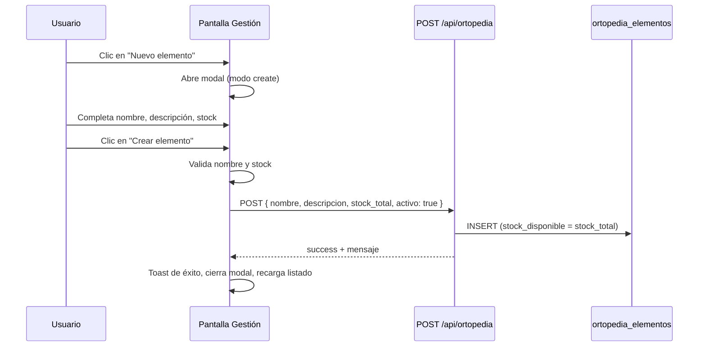
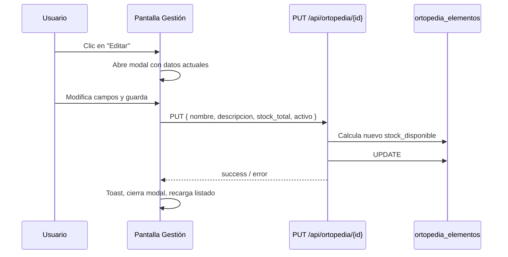
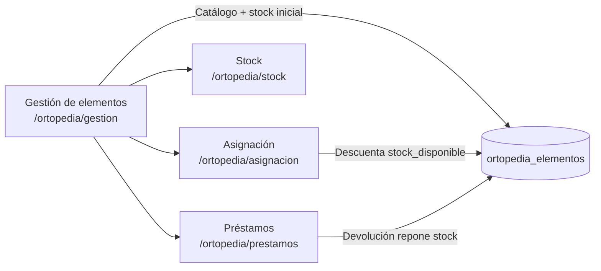

# Gestión de elementos ortopédicos

## Objetivo

El módulo **Gestión de elementos** permite administrar el catálogo de elementos ortopédicos disponibles en la mutual (muletas, caminadores, sillas de ruedas, etc.). Desde aquí se realizan las operaciones de **alta, edición y eliminación (ABM)** de cada ítem, definiendo su nombre, descripción, stock total y estado activo/inactivo.

Es el punto de partida del flujo de ortopedia: los elementos registrados aquí alimentan las pantallas de **Asignación**, **Stock** y **Préstamos**.

---

## Acceso y navegación

| Aspecto | Detalle |
|---------|---------|
| **Ruta** | `/ortopedia/gestion` |
| **Menú lateral** | Grupo *Ortopedia* → *Gestión de elementos* |
| **Módulo interno** | `ortopedia-gestion` |
| **Página Next.js** | `src/app/ortopedia/gestion/page.tsx` |
| **Componente principal** | `src/modules/ortopedia/ortopedia-module-page.tsx` (sección `gestion`) |

### Permisos por rol

Solo los roles con acceso al módulo `ortopedia-gestion` pueden ver y operar esta pantalla:

| Rol | Acceso |
|-----|--------|
| `admin_vanesa` | Sí |
| `developer` | Sí |
| `ortopedia_admin` | Sí |
| `admin` | No |
| `especialista` | No |

Si el usuario no tiene permiso, se muestra una tarjeta de **Acceso restringido** en lugar del contenido del módulo.

---

## Interfaz de usuario

### Estructura de la pantalla

1. **Encabezado** — Título *Gestión de elementos ortopédicos* con breadcrumb *Ortopedia*.
2. **Botón "Nuevo elemento"** — Abre el modal de creación.
3. **Tarjeta "Elementos registrados"** — Listado de todos los elementos del catálogo.

### Listado de elementos

Cada fila (o tarjeta en pantallas pequeñas) muestra:

| Campo | Descripción |
|-------|-------------|
| **Elemento** | Nombre del ítem |
| **Descripción** | Texto opcional; muestra `-` si está vacío |
| **Total** | Stock total registrado |
| **Disponible** | Unidades libres para préstamo |
| **Acciones** | Editar / Eliminar |

**Responsive:**

- En pantallas **≥ 1400px**: tabla clásica con columnas.
- En pantallas **< 1400px**: tarjetas apiladas (`data-card`) con la misma información y botones de acción.

Si no hay elementos cargados, se muestra un **EmptyState** con el mensaje: *"Todavía no hay elementos ortopédicos cargados."*

### Modal de creación / edición

El mismo diálogo se reutiliza para alta y modificación:

| Campo | Creación | Edición | Validación |
|-------|----------|---------|------------|
| **Nombre** | Obligatorio | Obligatorio | No puede estar vacío |
| **Descripción** | Opcional | Opcional | — |
| **Stock total** | Obligatorio | Obligatorio | Entero ≥ 0 |
| **Elemento activo** | No visible (se crea activo) | Checkbox | Solo en edición |

Botones del modal: **Cancelar** y **Crear elemento** / **Guardar cambios**. Durante el guardado, los campos se deshabilitan y el botón muestra *"Guardando..."*.

---

## Flujos operativos

### 1) Crear un elemento



**Comportamiento al crear:**

- `stock_disponible` se inicializa igual a `stock_total` (ninguna unidad prestada).
- `activo` se guarda como `1` (activo) por defecto.
- El nombre debe ser **único** (comparación case-insensitive en base de datos).

### 2) Editar un elemento



**Regla de stock al editar:**

El sistema calcula cuántas unidades están actualmente prestadas:

```
prestados = stock_total_actual - stock_disponible_actual
```

- El nuevo `stock_total` **no puede ser menor** que `prestados`.
- El nuevo `stock_disponible` se recalcula como: `max(stock_total_nuevo - prestados, 0)`.

Ejemplo: si hay 5 unidades totales y 2 disponibles (3 prestadas), el stock total mínimo permitido es **3**.

### 3) Eliminar un elemento

1. El usuario confirma con un `window.confirm`.
2. Se envía `DELETE /api/ortopedia/{id}`.
3. **No se permite eliminar** si existen préstamos en estado `ACTIVO` o `VENCIDO` sin devolución para ese elemento.
4. Si la eliminación es exitosa, se muestra toast y se recarga el listado.

---

## Modelo de datos

Tabla: `dbo.ortopedia_elementos` (SQL Server)

| Columna | Tipo | Descripción |
|---------|------|-------------|
| `id` | INT IDENTITY | Clave primaria |
| `nombre` | VARCHAR(120) | Nombre único del elemento |
| `descripcion` | VARCHAR(500) | Detalle opcional |
| `stock_total` | INT | Cantidad total en inventario |
| `stock_disponible` | INT | Unidades no prestadas |
| `activo` | BIT | Habilita/deshabilita el ítem para asignación |
| `creado_en` | DATETIME | Fecha de alta |
| `actualizado_en` | DATETIME | Última modificación |

**Restricciones:**

- `UQ_ortopedia_elementos_nombre`: nombre único.
- `CK_ortopedia_elementos_stock_nonnegative`: `stock_total ≥ 0`, `stock_disponible ≥ 0` y `stock_disponible ≤ stock_total`.

Script de creación: `sql/2026_ortopedia_modulo.sql`.

---

## API utilizada

### Listado (carga inicial)

```
GET /api/ortopedia
```

Devuelve `{ elementos, prestamos }`. La pantalla de Gestión usa únicamente el arreglo `elementos`, ordenado por nombre.

### Crear elemento

```
POST /api/ortopedia
Content-Type: application/json

{
  "nombre": "Silla de ruedas",
  "descripcion": "Adulto estándar",
  "stock_total": 2
}
```

Respuesta exitosa: `{ success: true, message: "Elemento ortopédico creado" }`.

### Obtener un elemento (endpoint disponible, no usado directamente por la UI de gestión)

```
GET /api/ortopedia/{id}
```

### Actualizar elemento

```
PUT /api/ortopedia/{id}
Content-Type: application/json

{
  "nombre": "Silla de ruedas",
  "descripcion": "Adulto estándar",
  "stock_total": 3,
  "activo": true
}
```

### Eliminar elemento

```
DELETE /api/ortopedia/{id}
```

---

## Validaciones y mensajes de error

### Validaciones en frontend

| Condición | Mensaje |
|-----------|---------|
| Nombre vacío | *"Ingresa nombre del elemento"* |
| Stock no entero o negativo | *"Stock total inválido"* |

### Validaciones en backend

| Condición | Mensaje |
|-----------|---------|
| Nombre duplicado (alta) | *"Ya existe un elemento con ese nombre"* |
| Nombre duplicado (edición) | *"Ya existe otro elemento con ese nombre"* |
| Stock total < unidades prestadas | *"No puedes bajar el stock total por debajo de X (actualmente prestados)"* |
| Eliminar con préstamos activos/vencidos | *"No se puede eliminar: hay préstamos activos o vencidos para este elemento"* |
| Elemento no encontrado | HTTP 404 |

Los errores y éxitos se comunican al usuario mediante **toasts** (`sonner`).

---

## Relación con otros submódulos de Ortopedia



| Submódulo | Uso del catálogo |
|-----------|------------------|
| **Asignación** | Solo muestra elementos **activos** con `stock_disponible > 0` |
| **Stock** | Vista de solo lectura de total/disponible/estado |
| **Préstamos** | Referencia el elemento por `elemento_id` en cada préstamo |

Un elemento marcado como **inactivo** en edición deja de aparecer en el selector de asignación, pero sigue visible en Gestión y Stock.

---

## Archivos relevantes

| Archivo | Responsabilidad |
|---------|-----------------|
| `src/app/ortopedia/gestion/page.tsx` | Ruta de la página |
| `src/modules/ortopedia/ortopedia-module-page.tsx` | UI, estado y lógica del ABM |
| `src/app/api/ortopedia/route.ts` | GET (listado) y POST (alta) |
| `src/app/api/ortopedia/[id]/route.ts` | GET, PUT y DELETE por ID |
| `src/components/layout/navigation-config.tsx` | Entrada en menú lateral |
| `src/lib/user-context.tsx` | Control de acceso por rol |
| `sql/2026_ortopedia_modulo.sql` | Esquema y datos semilla |

---

## Resumen operativo

1. El operador ingresa a **Ortopedia → Gestión de elementos**.
2. Carga el catálogo inicial con **Nuevo elemento** (nombre, descripción, stock).
3. Consulta el listado con stock total y disponible.
4. Ajusta datos o desactiva ítems con **Editar** (respetando unidades prestadas).
5. Elimina ítems solo cuando no tienen préstamos pendientes.
6. Los elementos activos con stock quedan disponibles para **Asignación de elementos**.
